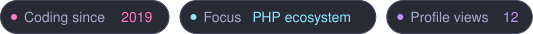

<!-- ============================== HERO ============================== -->

  

  

  

 

<!-- ============================== ABOUT ============================== -->

  <picture>
    <source media="(prefers-color-scheme: dark)" srcset="./assets/headings/about-dark.svg" />
    
  </picture>

  

 

<!-- ============================ TECH STACK ============================ -->

  <picture>
    <source media="(prefers-color-scheme: dark)" srcset="./assets/headings/stack-dark.svg" />
    
  </picture>

  

 

<!-- ============================== CONNECT ============================== -->

  <picture>
    <source media="(prefers-color-scheme: dark)" srcset="./assets/headings/connect-dark.svg" />
    
  </picture>

<!-- Replace the placeholder links: LinkedIn URL, email, WhatsApp number (country code, no + or spaces), Telegram username -->

  
  
   
  
  

 

<!-- =============================== STATS =============================== -->

  <picture>
    <source media="(prefers-color-scheme: dark)" srcset="./assets/headings/stats-dark.svg" />
    
  </picture>

<!-- These three cards are rebuilt twice a day by .github/workflows/profile-cards.yml -->

  

  

  

<!-- =============================== FOOTER =============================== -->
 

  

<!-- Invisible profile-view counter: keeps counting visits for the "Profile views" pill. Don't remove. -->

